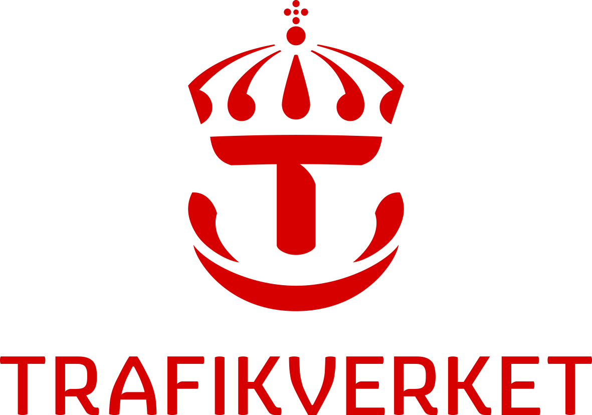

In the framework of Europe’s Rail, SmartRaCon is composed by the following partners.

{:target="blank"}
{:target="blank"}
{:target="blank"}
{:target="blank"}
{:target="blank"}

# Steering Committee
  - [Jaizki Mendizabal Samper](https://www.linkedin.com/in/jaizki/), Ceit Research Center, Spain
  - [Michael Meyer zu Hörste](https://www.dlr.de/en/contacts/m/meyer-zu-hoerste-michael), German Aerospace Center, Germany
  - [Marvin Damschen](https://www.ri.se/en/person/marvin-damschen), RISE Research Institutes of Sweden, Sweden
  - [Markus Brachner](https://www.sintef.no/en/all-employees/employee/markus.brachner/), SINTEF, Norway

# Technical Committee
  - ...

# Organising Committee
  - ...

