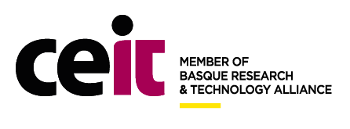
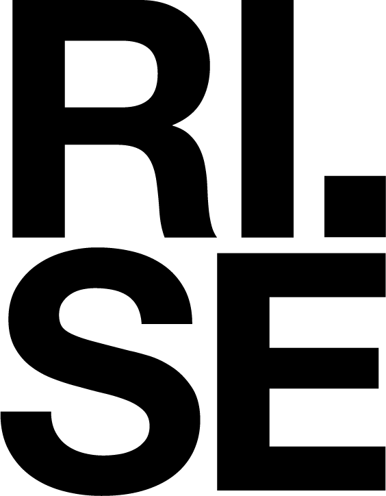

In the framework of Europe’s Rail, SmartRaCon is composed by the following partners.

{:style="text-align:center;"}
{:target="blank"}
{:target="blank"}
{:target="blank"}
{:target="blank"}
{:target="blank"}

{:style="text-align:center;"}
{:target="blank"}
{:target="blank"}

# Steering Committee
  - [Jaizki Mendizabal Samper](https://www.linkedin.com/in/jaizki/), CEIT Research Center, Spain
  - [Michael Meyer zu Hörste](https://www.dlr.de/en/contacts/m/meyer-zu-hoerste-michael), German Aerospace Center, Germany
  - [Marvin Damschen](https://www.ri.se/en/person/marvin-damschen), RISE Research Institutes of Sweden, Sweden
  - [Markus Brachner](https://www.sintef.no/en/all-employees/employee/markus.brachner/), SINTEF, Norway
  - [Marion Berbineau](https://www.linkedin.com/in/marion-berbineau-35158b6/), Université Gustave Eiffel, France
  - [Agnieszka Łukasiewicz](https://www.linkedin.com/in/agnieszka-lukasiewicz-ph-d-189804/), Road and Bridge Institute, Warsaw, Poland

# Technical Committee
- Iñigo Adin, CEIT Research Center, Spain
- Markus Brachner, SINTEF, Norway
- Marvin Damschen, RISE Research Institutes of Sweden, Sweden
- Nerea Fernandez, CEIT Research Center, Spain
- Svenja Hainz, German Aerospace Center, Germany
- Marie Lindland, SINTEF, Norway
- Jaizki Mendizabal Samper, CEIT Research Center, Spain
- Michael Meyer zu Hörste, German Aerospace Center, Germany
- Gorka de Miguel, CEIT Research Center, Spain
- Ramana Reddy Avula, RISE Research Institutes of Sweden, Sweden
- Paul Unterhuber, German Aerospace Center, Germany
- Paul Zabalegui, CEIT Research Center, Spain

# Organising Committee
- Marion Berbineau, University Gustave Eiffel, Villeneuve d’Ascq, France
- Markus Brachner, SINTEF, Oslo, Norway
- Marvin Damschen, RISE, Borås, Västra Götaland County, Sweden
- Agnieszka Łukasiewicz, Road and Bridge Institute, Warsaw, Poland
- Jaizki Mendizabal, CEIT, San Sebastián, Gipuzkoa, Spain
- Michael Meyer zu Hörste, German Aerospace Center, Germany
- Sergio Arana, CEIT, San Sebastián, Gipuzkoa, Spain
- Gorka de Miguel, CEIT, San Sebastián, Gipuzkoa, Spain
- Ion Grijalbo, CEIT, San Sebastián, Gipuzkoa, Spain
- Maria Alonso, CEIT, San Sebastián, Gipuzkoa, Spain
