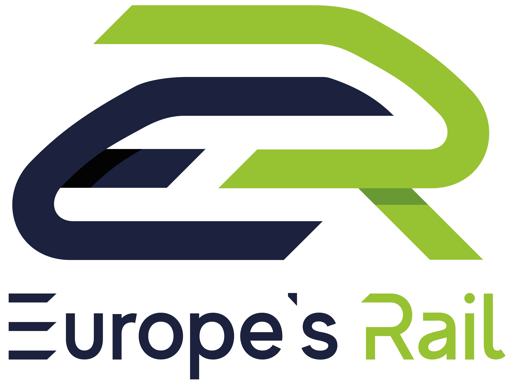
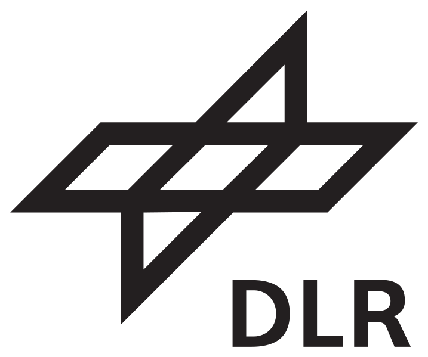
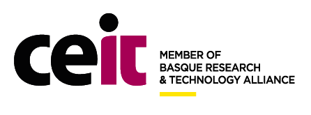
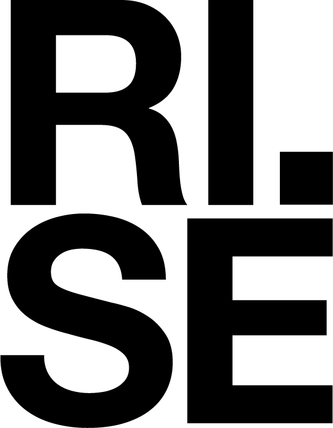
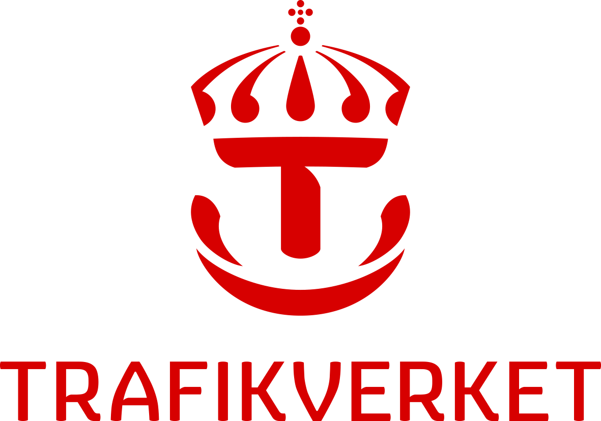
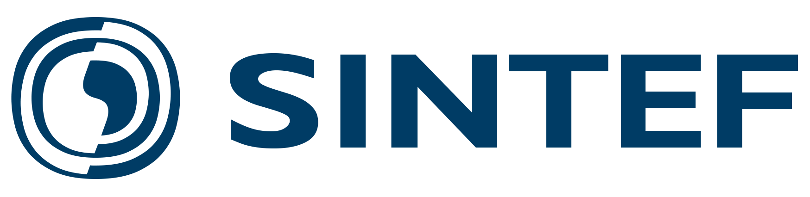
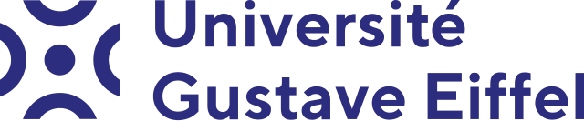

  <iframe
      src="https://www.youtube.com/embed/uINcmgcyGc8?autoplay=1&mute=1"
      width="960"
      height="540"
      frameborder="0"
      allowfullscreen="true"
      allow="autoplay; encrypted-media">
  </iframe>

**Presentations and posters downloadable from the [program](/2024/program)!**

**Proceedings available:** [6th SmartRaCon Scientific Seminar - Proceedings, 2024](https://www.ceit.es/documents/24233193/41324655/SRC6SS_Proceedings_2024.pdf)

## Important dates
  - ~~Deadline for submission (extended): July 14th, 2024~~
  - ~~Notification of acceptance: August 6th, 2024~~
  - ~~Deadline for final paper submission: August 30th, 2024~~
  - ~~Registration opens: September 1st, 2024~~ ~~**Registration open!**~~

  ~~[Register here.]()~~

## About SmartRaCon
In the last years, railway related research and innovation is carried out at European level within the framework of the Shift2Rail Joint Undertaking. The work related to control, command and signalling for automation and safety purposes is carried out in the projects X2Rail-1 to X2Rail-5, among others. The associate members of Shift2Rail part of "Smart Rail Control - SmartRaCon" Railenium (FR), GMV-NSL (UK), CEIT (ES) and DLR (DE) set themselves the goal of hosting an annual scientific seminar on one of the X2Rail projects. After the first one in 2019 in Villeneuve d'Ascq was hosted as a face-to-face event by Railenium, the second one in 2020 could be executed very successfully as a digital event by CEIT as well as the third in 2021 by DLR. In 2022, the fourth edition followed, as hybrid event in San Sebastian hosted by CEIT. And finally in 2023 the fifth edition was hosted by GMV and DLR together as hybrid event in Berlin-Adlershof, where the focus was on the X2RAIL-5 and TAURO projects.

Now, railway related research and innovation is carried out at European level within the framework of the Europe’s Rail Joint Undertaking considers five areas of priority: European rail traffic management and supporting rail’s key role in a multimodal transport system, Digital and automated train operations, Sustainable and digital assets, Competitive digital green rail freight and Smart solutions for low density traffic lines (cost-efficient regional lines). In this new framework, the Research Institutes CEIT (ES), DLR (DE), RISE (SE) and SINTEF (NO) members of SmartRaCon set themselves the goal of hosting an annual scientific seminar on the scientific results obtained in the different flagship projects part of Europe’s Rail.

## Previous editions

 - [1st SmartRaCon Scientific Seminar - Proceedings, 2019](https://www.dlr.de/de/ts/medien/publikationen/berichtsreihe/volume_35_1st_smartracon_scientific_seminar_2019.pdf/@@download/file)
 - [2nd SmartRaCon Scientific Seminar - Proceedings, 2020](https://www.dlr.de/de/ts/medien/publikationen/berichtsreihe/volume_37_2nd_smartracon_scientific_seminar_2020.pdf/@@download/file)
 - [3rd SmartRaCon Scientific Seminar - Proceedings, 2021](https://www.dlr.de/de/ts/medien/publikationen/berichtsreihe/volume_38_3rd_smartracon_scientific_seminar_2021.pdf/@@download/file)
 - [4th SmartRaCon Scientific Seminar - Proceedings, 2022](https://www.dlr.de/de/ts/medien/publikationen/berichtsreihe/volume_39_4th_smartracon_scientific_seminar_2022.pdf/@@download/file)
 - [5th SmartRaCon Scientific Seminar - Proceedings, 2023](https://www.dlr.de/de/ts/medien/publikationen/berichtsreihe/volume_40_5th_smartracon_scientific_seminar_2023.pdf/@@download/file)

## Support

{:style="text-align:center;"}
{:target="blank"}
{:target="blank"}

{:style="text-align:center;"}
{:target="blank"}
{:target="blank"}
{:target="blank"}
{:target="blank"}
{:target="blank"}

{:style="text-align:center;"}
{:target="blank"}
{:target="blank"}

{:class="thanks"}
SmartRaCon is partly supported by funding from the European Union’s Horizon Europe research and innovation programme through the Europe's Rail Joint Undertaking.

