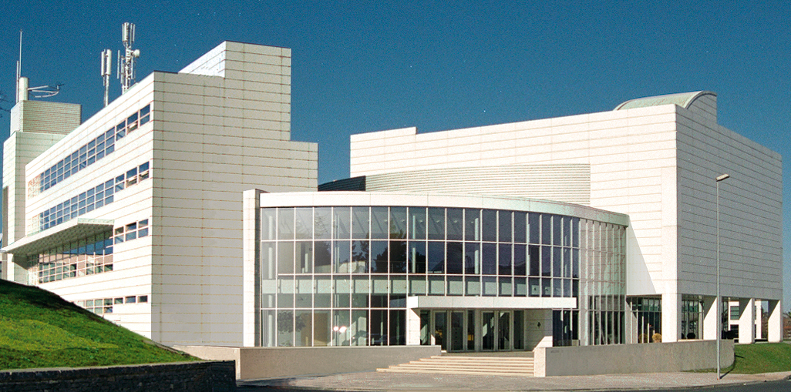

SmartRaCon 2024 will take place at [Miramon Technological Park, Paseo Mikeletegi, 53 - 20009 Donostia / San Sebastián, Spain](https://www.google.com/maps/search/Miramon+Technological+Park,+Paseo+Mikeletegi,+53+-+20009+Donostia+%2F+San+Sebasti%C3%A1n,+Spain/@43.29189,-1.9874781,17z/data=!3m1!4b1?entry=ttu)

[Click here](https://d25ltszcjeom5i.cloudfront.net/105557/pzuglruwvv/6th_SmartRaCon_Workshop_INFO_SanSebastian.pdf) for more information about travelling there.

<!-- You can adapt the design as well as the section shown on the map by copying the `assets/js/main.js` from the theme's repository and editing it. See also the subsection [Location / Room Overview](https://github.com/DigitaleGesellschaft/jekyll-theme-conference/#location--room-overview) section of the theme's README file. -->
